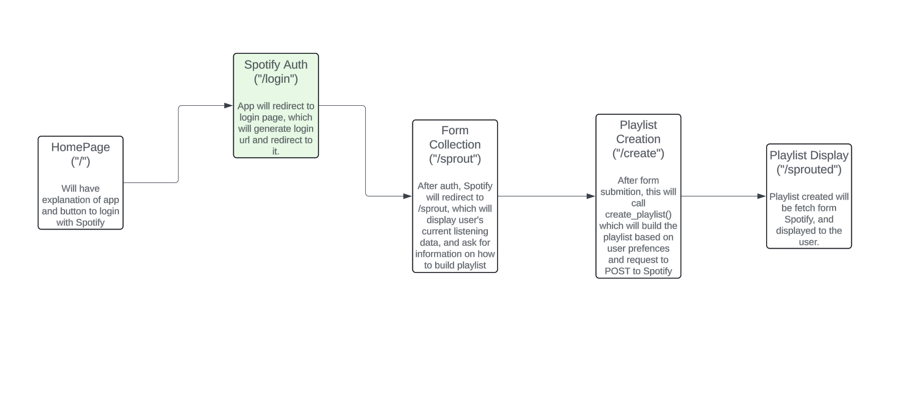

# COMS W3132 Individual Project

## Author
Danielle Odigie (odigiedanielle@gmail.com)

## Project Title
### 🌱 Sprout-ify 🌱

## Project Description

I'm a big music listener, but I (along with many people I've talked to) run into the issue where I listen to the same music over and over because I'm afraid to branch out. So, this semester, I want ot work on Sprout-ify, a web app which will allow users to see their listening data and find new artists and songs that align with their current tastes. After connecting to a user's Spotify, the app will compile a user's recent listening history, then recommend songs based on different aspects (sprouts) like most listened to artists, favorite genre, BPM, etc. These recommendations will be compiled into a playlist that the user can add to their Spotify. This differs from current Spotify features because the user will be able to choose which sprout, or branch, they would want to take with their music, rather than being limited to the unknown algorithm making Daily Mixes.

## Running the project

This is a Flask app, so first install Flask using:

`pip install flask`

then install requests which handles HTTP requests:

`pip install requests`

To run this project, run:

`flask --app app.py --debug run`

and open the URL given.

## Timeline

*To track progress on the project, we will use the following intermediate milestones for your overall project. Each milestone will be marked with a tag in the git repository, and we will check progress and provide feedback at key milestones.*

| Date               | Milestone                                                                                              | Deliverables                | Git tag    |
|--------------------|--------------------------------------------------------------------------------------------------------|-----------------------------|------------|
| **March&nbsp;29**  | Submit project description                                                                             | README.md                   | proposal   |
| **April&nbsp;5**   | Update project scope/direction based on instructor/TA feedback                                         | README.md                   | approved   |
| **April&nbsp;12**  | Basic project structure with empty functions/classes (incomplete implementation), architecture diagram | Source code, comments, docs | milestone1 |
| **April&nbsp;19**  | Progress on implementation (define your own goals)                                                     | Source code, unit tests     | milestone2 |
| **April&nbsp;26**  | Completely (or partially) finished implementation                                                      | Source code, documentation  | milestone3 |
| **May&nbsp;10**    | Final touches (conclusion, documentation, testing, etc.)                                               | Conclusion (README.md)      | conclusion |

*The column Deliverables lists deliverable suggestions, but you can choose your own, depending on the type of your project.*

## Requirements, Features and User Stories

This project will use:
- Python Flask
- Spotify API
    - Because I am using an API, the app is subject to rate limits. While I don't expect the app to initially exxceed any rate limits, if it does happen, Spotify sends a 429 Error and my app will handle that, displaying to the user that the rate limit was currently exceeded and the app will try again in some number of seconds

The Algorithm:
- Since I want the user to be able to follow different branches, I think I'll have them select what they might be interested in, then I'll query Spotify's API for recommendations for songs that fit those descriptions.   

## System or Software Architecture Diagram

## Development Methodology

By Milestone 2, I'd like to have the API calls working, and the general functionality of the user getting their playlist working. After that, I'll work on the web design. I've tested by creating playlists using every branch.

## Conclusion and Future Work
I really enjoyed working on this project, as it aligns with my interests. Working with the Spotify API was challenging, and it really gave me a lesson in thoroughly reading documentation. If I were to keep working on this, I would explain the logic of how it generates playlists so the playlists are so disjointed if users have diverse listening history.
